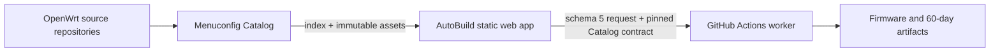

# 目录结构与技术架构 / Project Structure & Architecture

## 1. 双仓职责 / Two-repository boundary



Catalog 是数据层：

- 自动发现 Source/Branch；
- 提取 Target/Profile、Kconfig menu、symbol/type、默认值、依赖和帮助；
- 发布 schema 2 兼容性证据、精选应用及跨源体积观测；
- 提供手动包级探测工具。

AutoBuild 是通用工具层：

- 绑定当前代码分支到相应 Catalog 数据分支；
- 渲染 Catalog、执行通用 Kconfig intent 与兼容性方案；
- 导出 schema 5 完整请求并进行 exact-ref 路由；
- 调用上游构建脚本、收集和发布产物。

Catalog is the data layer. AutoBuild is a generic consumer and build orchestrator. AutoBuild must not duplicate device matrices, seed configs, plugin catalogs, dependencies, or rule-specific package knowledge.

## 2. 当前目录 / Current layout

```text
WeiG-OpenWrt-AutoBuild/
├─ .github/workflows/          build routing, worker, cancellation, CI and Pages
├─ Shell/                      generic upstream/build adapters
├─ config/project.json         canonical clone/project configuration
├─ config/project.schema.json  project configuration schema
├─ config/policies/            one small package-mirror policy
├─ docs/                       bilingual developer documentation
├─ site/wrt/
│  ├─ index.html               static UI shell
│  ├─ app.css                  shared responsive presentation
│  ├─ app.js                   generic Catalog consumer
│  ├─ lib/
│  │  ├─ catalog-loader.js     immutable index/asset contract loader
│  │  ├─ catalog-engine.js     Kconfig + compatibility executor
│  │  ├─ catalog-schema6.js    split Catalog asset reader
│  │  └─ build-identity.js     shared Issue/Run/Artifact naming
│  └─ data/                    deployment identity, i18n, timezone, project and mirror projection only
├─ tools/                      preparation, validation, request and deployment tools
└─ VERSION                     Asia/Shanghai project version
```

There is intentionally no local device tree, public base config, generated package page, or weekly upstream-data synchronizer.

### 项目配置 / Project configuration

`config/project.json` 是克隆者唯一需要编辑的项目级配置源。运行 `node tools/dev-assistant.mjs prepare` 会校验它，并生成 `site/wrt/data/project.json` 与 `Shell/build-defaults.conf`；生成投影不能反向作为配置源直接编辑。`project.displayName` 和 `project.shortName` 只负责页面标题、短品牌和通知展示，前端在配置加载后通过文本节点呈现；它们不会改变网关身份、`[build]` 请求协议或 Run/Artifact 标题格式。

`catalog.repository`、`catalog.releaseTag` 与 `catalog.selection` 只描述 Catalog 地址与首选项；`catalog.loading` 仅保留现有运行时调度 contract，不作为本期新增可选参数。Source、Branch、Target/Profile、Kconfig、插件、依赖和兼容性事实仍由 Catalog runtime data 负责，不能在项目配置中复制一份清单。`ui`、`firmware`、`build` 与 `admission` 只提供对应的默认值和准入上限。

密码模式 `prompt` 由提交者输入，`empty` 明确使用空密码；`secret` 模式必须配置仓库 Secret `DEFAULT_ROOT_PASSWORD`。实际密码不得写入配置源、任何生成投影、构建请求、Issue 或日志。

网页翻译的权威源是 `tools/i18n-source.json` 与 `tools/i18n-translations.json`；`site/wrt/data/i18n/` 只保存生成包。公开文案保持中性，不把工具、模型或厂商名称写进公共界面。

The clone-specific source of truth is `config/project.json`. `node tools/dev-assistant.mjs prepare` validates it and generates the site and build-script projections. Project names are presentation-only and are rendered as text after the projection loads; they do not alter gateway identity, the `[build]` request protocol, or Run/Artifact title formats. `catalog.loading` preserves the existing runtime scheduling contract and is not a new clone-specific option. Catalog inventory and package facts remain Catalog-owned, and password mode `secret` requires the repository Secret `DEFAULT_ROOT_PASSWORD`; the password itself must never be stored in configuration, projections, requests, Issues, or logs.

The translation authorities are `tools/i18n-source.json` and `tools/i18n-translations.json`; `site/wrt/data/i18n/` contains generated bundles only. Keep public wording neutral and do not add tool, model, or vendor names to the public interface.

## 3. Catalog channels and loading / Catalog 通道与加载

AutoBuild code channels bind to data branches:

| AutoBuild | Catalog data |
| --- | --- |
| `fix/*` | `catalog-fix` |
| `dev` | `catalog-dev` |
| `staging` | `catalog-staging` |
| `main` | `catalog-data` |

These are **runtime consumption channels**, not Catalog build destinations. Catalog code and production data have independent lifecycles: Catalog `main` builds only `catalog-candidate`; only the Catalog Production Gate may promote that verified snapshot to `catalog-data`. AutoBuild therefore keeps `main → catalog-data` and never reads `catalog-candidate` at runtime. This separation lets Catalog code reach `main` without implicitly changing production users, while `dev` and `staging` continue to consume their matching data branches.

The browser loads the current menu, language shard, and package-mirror projection together with bounded startup concurrency. The generated `site/wrt/data/project.json` projection then controls a low-priority queue for applications, hidden options, help, and compatibility. Every asset is checked against its index byte length and SHA-256 contract. A matching immutable cache entry is reused; submit and self-check still await the assets they actually validate.

Catalog 自动发现由 Catalog 配置决定。当前策略覆盖：

- OpenWrt：`main` 与 `openwrt-*`；
- ImmortalWrt：`master` 与 `openwrt-*`；
- LEDE：`master` 与 `openwrt-*`；
- 其他登记源：按各自配置。

未来 `openwrt-26.xx`、`27.xx` 及后续分支由 Catalog 自动发现和发布，AutoBuild 无需每周提交源码。Catalog 的每日翻译也从 `index.json` 枚举 Branch 与 schema 6 语言分片，因此新分支不要求修改翻译代码。

## 4. Selection and serialization / 选择与序列化

Both curated applications and Advanced menuconfig resolve to Catalog `PACKAGE_*` records. The single state transition is:

```text
user intent → catalog-engine dependency/select cascade → state map → Kconfig serializer
```

- bool/tristate use legal Catalog states only;
- string, empty string, literal `n`, escaping, int, hex, and unknown imported symbols retain type-aware serialization;
- Target/Profile and hidden defaults are derived from Catalog, not source-specific JavaScript constants;
- the page never carries a second dependency JSON;
- concrete package/rule names are forbidden in `app.js`.

Advanced menuconfig preserves parentless Catalog `path: []` records under the synthetic UI label **Root Kconfig options / 根级 Kconfig 选项**. This container is distinct from upstream **Global build settings**; removing or merging it would make top-level Kconfig records unreachable. Only the label is local UI text, while the records and their semantics remain Catalog-owned.

## 5. Compatibility evidence / 兼容性证据

`compatibility.json.gz` accepts schema 2 only. Rules use generic fields:

- `issue`: `file-ownership` or `build-failure`;
- `match`: `all-installed` or `all-selected`;
- `scope`: named Source or `*`, with exact Branch or glob;
- one to sixteen package IDs, optional Kconfig condition, paths where applicable, and evidence references.

Execution remains:

```text
evaluateCompatibilityRules
  → deriveCompatibilityPlans
  → applyUserIntent
```

The browser renders data-driven wording, keeps the modal open after applying a recommendation, resets the action when the user changes a relevant state, and requires a second explicit confirmation for force-continue. The backend does not add conflict locks or feed-time package removals.

## 6. Build request and Actions identity / 构建请求与 Actions 身份

The browser exports one schema 5 `build-request.json` with:

- exact AutoBuild branch/full commit;
- exact Catalog revision and source asset contract;
- Source/Branch and Catalog build-adapter names;
- Target/Profile build contract and full `.config`;
- user tag, firmware settings, Defconfig state, and forced compatibility evidence.

The default-branch dispatcher freezes the Issue snapshot, validates exact branch HEAD, then dispatches the worker on that exact ref. Run titles and artifacts bind to the Issue:

```text
staging-260810_0857/匿名#161/Generic_x86/64/lede/master/generic
staging-260810_0857-匿名#161-BUILD-LOGS
```

`/cancel` and admission parse the same `#Issue` identity and query the Issue author. Non-owner users are limited to three queued or running builds by one chronological admission policy. The repository owner has no project-level limit, and build jobs use no modulo concurrency slots; GitHub-hosted runner quotas remain external. All downloadable build artifacts retain 60 days; the internal raw bridge retains one day only.

## 7. Package probes / 包级探测

The bottom-right web **检** control opens self-test immediately. Probe and Advanced menuconfig use the same live `menuValues` and the same `setMenuValue()` → `applyMenuValue()` → Catalog/Kconfig intent path. The clicked symbol is never reverse-mapped to a LuCI package: selecting `PACKAGE_x` changes only that symbol and its forward dependencies, while selecting `PACKAGE_luci-app-x` can enable `PACKAGE_x` only when the upstream Kconfig/package relation requires it. Probe's **Selected / 已选择** summary is a one-line diff from the current Source/Branch/Target Kconfig baseline, so upstream defaults are hidden there; overflow is folded behind `+N`. The result list still reflects the complete live Kconfig state. Permanent policy copy is removed from the workspace and opened from an **Info / 说明** action left of Preview. Submit serializes only direct `packageIntent` and compact before/after projections into the Catalog Issue state token. The complete Advanced menuconfig/Defconfig state remains local UI evidence; every Probe environment resolves dependencies again from Catalog Target/Profile selectors and upstream Defconfig. No `probe-request.json` file or second package-selection model exists.

The controller consumes the schema-3 package state serialized by Advanced menuconfig, preserves Baseline, direct Intent, Final `m/y` values, and applies the five-dimensional Catalog environment scope plus coverage without mapping curated application IDs back into packages. The UI renders one Catalog-described, shared-tooltip depth interface in this fixed order: `config-resolve`, `package-compile`, `rootfs-integration`, `firmware-integration`, `boot-smoke`, `runtime-health`, `reboot-validation`. Each Matrix job:

1. shallow/filtered clones one Source/Branch;
2. installs feeds;
3. selects one to eight packages on a Catalog-derived legal Target/Profile, preferring x86/64 for automatic coverage;
4. after implicit `L0` asset validation, runs one of seven generic selectable depths: L1 official config resolution, L2 package compile, L3 RootFS integration, L4 one Final firmware integration, L5 upstream qemustart boot smoke, L6 runtime health, or L7 reboot validation; L2-L7 progressively reuse completed stages;
5. tries configured fallback targets sequentially inside an automatic-target Job and records coverage without treating infrastructure failures as package failures;
6. uploads normalized evidence for 60 days and full logs for 30 days.

The Issue carries one schema-3 compressed state token, not an uploaded request file. Catalog's default-branch gateway validates the state hash, permissions and Issue identity, then dispatches the worker to the request's exact code channel; the worker re-reads the same Issue state before a Matrix exists. The Matrix is capped at 256 jobs. The owner can use the complete planned concurrency without a project cap, other write collaborators are capped at 3, and visitors cannot start it. Source/Branch rows come only from Catalog index. Evidence never edits compatibility rules automatically, and only 100% package-caused failure across all legal environments may become a global incompatibility conclusion. The requester or a write collaborator can reply with exactly `/cancel`; normal cancellation precedes force cancellation.

## 8. Release identity and promotion / 发布身份与晋级

Every AutoBuild change runs `node tools/dev-assistant.mjs prepare`. It canonicalizes site bytes, writes an Asia/Shanghai `VERSION`, synchronizes `site-version.json`, calculates the full-site SHA-256, and runs generic checks. `verify` is read-only.

Normal promotion remains `dev → staging → main`; Catalog and AutoBuild advance independently but each AutoBuild channel reads its matching Catalog data channel. Publish Catalog before the matching AutoBuild channel whenever an asset contract changes.
