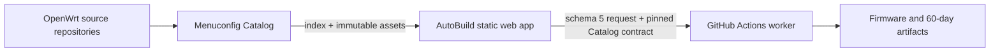

# 目录结构与技术架构 / Project Structure & Architecture

## 1. 双仓职责 / Two-repository boundary



Catalog 是数据层：

- 自动发现 Source/Branch；
- 提取 Target/Profile、Kconfig menu、symbol/type、默认值、依赖和帮助；
- 发布 schema 2 兼容性证据、精选应用及跨源体积观测；
- 提供手动包级探测工具。

AutoBuild 是通用工具层：

- 绑定当前代码分支到相应 Catalog 数据分支；
- 渲染 Catalog、执行通用 Kconfig intent 与兼容性方案；
- 导出 schema 5 完整请求并进行 exact-ref 路由；
- 调用上游构建脚本、收集和发布产物。

Catalog is the data layer. AutoBuild is a generic consumer and build orchestrator. AutoBuild must not duplicate device matrices, seed configs, plugin catalogs, dependencies, or rule-specific package knowledge.

## 2. 当前目录 / Current layout

```text
WeiG-OpenWrt-AutoBuild/
├─ .github/workflows/          build routing, worker, cancellation, CI and Pages
├─ Shell/                      generic upstream/build adapters
├─ config/policies/            one small package-mirror policy
├─ docs/                       bilingual developer documentation
├─ docs-private/               ignored handoff, backup and local tools
├─ site/wrt/
│  ├─ index.html               static UI shell
│  ├─ app.css                  shared responsive presentation
│  ├─ app.js                   generic Catalog consumer
│  ├─ lib/
│  │  ├─ catalog-loader.js     immutable index/asset contract loader
│  │  ├─ catalog-engine.js     Kconfig + compatibility executor
│  │  ├─ catalog-schema6.js    split Catalog asset reader
│  │  └─ build-identity.js     shared Issue/Run/Artifact naming
│  └─ data/                    deployment identity, i18n, timezone, project and mirror projection only
├─ tools/                      preparation, validation, request and deployment tools
└─ VERSION                     Asia/Shanghai project version
```

There is intentionally no local device tree, public base config, generated package page, or weekly upstream-data synchronizer.

## 3. Catalog channels and loading / Catalog 通道与加载

AutoBuild code channels bind to data branches:

| AutoBuild | Catalog data |
| --- | --- |
| `fix/*` | `catalog-fix` |
| `dev` | `catalog-dev` |
| `staging` | `catalog-staging` |
| `main` | `catalog-data` |

These are **runtime consumption channels**, not Catalog build destinations. Catalog code and production data have independent lifecycles: Catalog `main` builds only `catalog-candidate`; only the Catalog Production Gate may promote that verified snapshot to `catalog-data`. AutoBuild therefore keeps `main → catalog-data` and never reads `catalog-candidate` at runtime. This separation lets Catalog code reach `main` without implicitly changing production users, while `dev` and `staging` continue to consume their matching data branches.

The browser loads the current menu, language shard, and package-mirror projection together with bounded startup concurrency. `site/wrt/data/project.json` then controls a low-priority queue for applications, hidden options, help, and compatibility. Every asset is checked against its index byte length and SHA-256 contract. A matching immutable cache entry is reused; submit and self-check still await the assets they actually validate.

Catalog 自动发现由 Catalog 配置决定。当前策略覆盖：

- OpenWrt：`main` 与 `openwrt-*`；
- ImmortalWrt：`master` 与 `openwrt-*`；
- LEDE：`master` 与 `openwrt-*`；
- 其他登记源：按各自配置。

未来 `openwrt-26.xx`、`27.xx` 及后续分支由 Catalog 自动发现和发布，AutoBuild 无需每周提交源码。Catalog 的每日翻译也从 `index.json` 枚举 Branch 与 schema 6 语言分片，因此新分支不要求修改翻译代码。

## 4. Selection and serialization / 选择与序列化

Both curated applications and Advanced menuconfig resolve to Catalog `PACKAGE_*` records. The single state transition is:

```text
user intent → catalog-engine dependency/select cascade → state map → Kconfig serializer
```

- bool/tristate use legal Catalog states only;
- string, empty string, literal `n`, escaping, int, hex, and unknown imported symbols retain type-aware serialization;
- Target/Profile and hidden defaults are derived from Catalog, not source-specific JavaScript constants;
- the page never carries a second dependency JSON;
- concrete package/rule names are forbidden in `app.js`.

Advanced menuconfig preserves parentless Catalog `path: []` records under the synthetic UI label **Root Kconfig options / 根级 Kconfig 选项**. This container is distinct from upstream **Global build settings**; removing or merging it would make top-level Kconfig records unreachable. Only the label is local UI text, while the records and their semantics remain Catalog-owned.

## 5. Compatibility evidence / 兼容性证据

`compatibility.json.gz` accepts schema 2 only. Rules use generic fields:

- `issue`: `file-ownership` or `build-failure`;
- `match`: `all-installed` or `all-selected`;
- `scope`: named Source or `*`, with exact Branch or glob;
- one to sixteen package IDs, optional Kconfig condition, paths where applicable, and evidence references.

Execution remains:

```text
evaluateCompatibilityRules
  → deriveCompatibilityPlans
  → applyUserIntent
```

The browser renders data-driven wording, keeps the modal open after applying a recommendation, resets the action when the user changes a relevant state, and requires a second explicit confirmation for force-continue. The backend does not add conflict locks or feed-time package removals.

## 6. Build request and Actions identity / 构建请求与 Actions 身份

The browser exports one schema 5 `build-request.json` with:

- exact AutoBuild branch/full commit;
- exact Catalog revision and source asset contract;
- Source/Branch and Catalog build-adapter names;
- Target/Profile build contract and full `.config`;
- user tag, firmware settings, Defconfig state, and forced compatibility evidence.

The default-branch dispatcher freezes the Issue snapshot, validates exact branch HEAD, then dispatches the worker on that exact ref. Run titles and artifacts bind to the Issue:

```text
staging-260810_0857/匿名#161/Generic_x86/64/lede/master/generic
staging-260810_0857-匿名#161-BUILD-LOGS
```

`/cancel` and admission parse the same `#Issue` identity and query the Issue author. Non-owner users are limited to three queued or running builds by one chronological admission policy. The repository owner has no project-level limit, and build jobs use no modulo concurrency slots; GitHub-hosted runner quotas remain external. All downloadable build artifacts retain 60 days; the internal raw bridge retains one day only.

## 7. Package probes / 包级探测

The bottom-right web **检** control opens self-test immediately. The self-test header places **Package compatibility probe** before Close; it opens a responsive in-page workspace that reuses the current Source/Branch Advanced menuconfig/Kconfig search semantics instead of maintaining a second package search model; Source/Branch inventory still comes from Catalog, while generic probe UI text remains AutoBuild-local. Advanced and Probe share one result priority: `luci-app-*` packages first, an exact ordinary package second, other `PACKAGE_*` matches next, and non-package upstream Kconfig options last. Selection itself stays native to Kconfig: enabling a package may enable its declared dependency closure, but enabling a dependency never selects reverse dependents. Probe keeps every `PACKAGE_*` result selectable as the explicit root package, leaves dependency expansion to each tested Kconfig, and shows non-package Kconfig matches as reference-only rows. Its one-row `L1–L4` depth controls expose help on hover/focus/click, Source/Branch scope and Target coverage share a select row, and custom pairs are searchable. A bounded-height modal keeps ordinary scrolling inside the result list. Results preserve complete IDs and reuse the global tooltip for truncated text; narrow screens reflow rather than add a second data representation. `CONFIG_PACKAGE_*`, `PACKAGE_*`, package names, and short matching IDs share the same search path. The plan is collapsed initially; Preview and Submit remain at the bottom. Submit downloads one `probe-request.json` containing only real short package names and opens the dedicated Catalog Issue form.

The controller reads the code channel's matching data-branch `index.json` and `applications.json.gz`, maps Catalog application IDs to packages, applies Source/Branch globs, and builds one dynamic Matrix. Each Matrix job:

1. shallow/filtered clones one Source/Branch;
2. installs feeds;
3. selects one to eight packages on a Catalog-derived legal Target/Profile, preferring x86/64 for automatic coverage;
4. after implicit `L0` asset validation, runs one of four generic selectable depths: `L1` package compile, `L2` RootFS integration, `L3` firmware A/B integration, or experimental `L4` **Boot smoke / 启动自检**;
5. tries configured fallback targets sequentially inside an automatic-target Job and records coverage without treating infrastructure failures as package failures;
6. uploads normalized evidence for 60 days and full logs for 30 days.

The Issue carries exactly one public schema-1 JSON attachment. Catalog's default-branch gateway validates its bytes, hash, permissions, assets, package mappings, scope, and targets, then dispatches the worker to the request's exact code channel. The worker downloads and verifies the same attachment before a Matrix exists. The Matrix is capped at 256 jobs. The owner can use the complete planned concurrency without a project cap, other write collaborators are capped at 3, and visitors cannot start it. Source/Branch rows come only from Catalog index, including future `openwrt-*` entries. Evidence never edits compatibility rules automatically, and only 100% package-caused failure across all legal environments may become a global incompatibility conclusion. The requester or a write collaborator can reply with exactly `/cancel`; normal cancellation precedes force cancellation.

## 8. Release identity and promotion / 发布身份与晋级

Every AutoBuild change runs `node tools/dev-assistant.mjs prepare`. It canonicalizes site bytes, writes an Asia/Shanghai `VERSION`, synchronizes `site-version.json`, calculates the full-site SHA-256, and runs generic checks. `verify` is read-only.

Normal promotion remains `dev → staging → main`; Catalog and AutoBuild advance independently but each AutoBuild channel reads its matching Catalog data channel. Publish Catalog before the matching AutoBuild channel whenever an asset contract changes.
