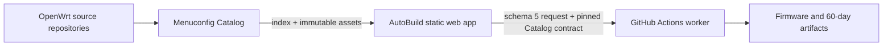

# 目录结构与技术架构 / Project Structure & Architecture

## 1. 双仓职责 / Two-repository boundary



Catalog 是数据层：

- 自动发现 Source/Branch；
- 提取 Target/Profile、Kconfig menu、symbol/type、默认值、依赖和帮助；
- 发布 schema 2 兼容性证据、精选应用及跨源体积观测；
- 提供手动包级探测工具。

AutoBuild 是通用工具层：

- 绑定当前代码分支到相应 Catalog 数据分支；
- 渲染 Catalog、执行通用 Kconfig intent 与兼容性方案；
- 导出 schema 5 完整请求并进行 exact-ref 路由；
- 调用上游构建脚本、收集和发布产物。

Catalog is the data layer. AutoBuild is a generic consumer and build orchestrator. AutoBuild must not duplicate device matrices, seed configs, plugin catalogs, dependencies, or rule-specific package knowledge.

## 2. 当前目录 / Current layout

```text
WeiG-OpenWrt-AutoBuild/
├─ .github/workflows/          build routing, worker, cancellation, CI and Pages
├─ Shell/                      generic upstream/build adapters
├─ config/policies/            one small package-mirror policy
├─ docs/                       bilingual developer documentation
├─ docs-private/               ignored handoff, backup and local tools
├─ site/wrt/
│  ├─ index.html               static UI shell
│  ├─ app.css                  shared responsive presentation
│  ├─ app.js                   generic Catalog consumer
│  ├─ lib/
│  │  ├─ catalog-loader.js     immutable index/asset contract loader
│  │  ├─ catalog-engine.js     Kconfig + compatibility executor
│  │  ├─ catalog-schema6.js    split Catalog asset reader
│  │  └─ build-identity.js     shared Issue/Run/Artifact naming
│  └─ data/                    deployment identity, i18n, timezone, project and mirror projection only
├─ tools/                      preparation, validation, request and deployment tools
└─ VERSION                     Asia/Shanghai project version
```

There is intentionally no local device tree, public base config, generated package page, or weekly upstream-data synchronizer.

## 3. Catalog channels and loading / Catalog 通道与加载

AutoBuild code channels bind to data branches:

| AutoBuild | Catalog data |
| --- | --- |
| `fix/*` | `catalog-fix` |
| `dev` | `catalog-dev` |
| `staging` | `catalog-staging` |
| `main` | `catalog-data` |

The browser first loads the current menu and language. `site/wrt/data/project.json` then controls a low-priority queue for applications, hidden options, help, compatibility, and package mirrors. Every asset is checked against its index byte length and SHA-256 contract. A matching immutable cache entry is reused; submit and self-check still force the required assets to finish before continuing.

Catalog 自动发现由 Catalog 配置决定。当前策略覆盖：

- OpenWrt：`main` 与 `openwrt-*`；
- ImmortalWrt：`master` 与 `openwrt-*`；
- LEDE：`master`；
- 其他登记源：按各自配置。

未来 `openwrt-26.xx` 由 Catalog 每周发现和发布，AutoBuild 无需每周提交源码。

## 4. Selection and serialization / 选择与序列化

Both curated applications and Advanced menuconfig resolve to Catalog `PACKAGE_*` records. The single state transition is:

```text
user intent → catalog-engine dependency/select cascade → state map → Kconfig serializer
```

- bool/tristate use legal Catalog states only;
- string, empty string, literal `n`, escaping, int, hex, and unknown imported symbols retain type-aware serialization;
- Target/Profile and hidden defaults are derived from Catalog, not source-specific JavaScript constants;
- the page never carries a second dependency JSON;
- concrete package/rule names are forbidden in `app.js`.

## 5. Compatibility evidence / 兼容性证据

`compatibility.json.gz` accepts schema 2 only. Rules use generic fields:

- `issue`: `file-ownership` or `build-failure`;
- `match`: `all-installed` or `all-selected`;
- `scope`: named Source or `*`, with exact Branch or glob;
- one to sixteen package IDs, optional Kconfig condition, paths where applicable, and evidence references.

Execution remains:

```text
evaluateCompatibilityRules
  → deriveCompatibilityPlans
  → applyUserIntent
```

The browser renders data-driven wording, keeps the modal open after applying a recommendation, resets the action when the user changes a relevant state, and requires a second explicit confirmation for force-continue. The backend does not add conflict locks or feed-time package removals.

## 6. Build request and Actions identity / 构建请求与 Actions 身份

The browser exports one schema 5 `build-request.json` with:

- exact AutoBuild branch/full commit;
- exact Catalog revision and source asset contract;
- Source/Branch and Catalog build-adapter names;
- Target/Profile build contract and full `.config`;
- user tag, firmware settings, Defconfig state, and forced compatibility evidence.

The default-branch dispatcher freezes the Issue snapshot, validates exact branch HEAD, then dispatches the worker on that exact ref. Run titles and artifacts bind to the Issue:

```text
staging-260810_0857/匿名#161/Generic_x86/64/lede/master/generic
staging-260810_0857-匿名#161-BUILD-LOGS
```

`/cancel` and admission parse the same `#Issue` identity and query the Issue author. Non-owner users are limited to three active builds. The repository owner uses `OWNER_BUILD_CONCURRENCY` (1–20, default 6). All downloadable build artifacts retain 60 days; the internal raw bridge retains one day only.

## 7. Package probes / 包级探测

Catalog's manual controller reads the active data-branch index, applies Source/Branch globs, and dispatches one child Run per matched pair with bounded concurrency. Each child:

1. shallow/filtered clones one Source/Branch;
2. installs feeds;
3. selects one to eight packages on x86;
4. builds tools/toolchain and `package/compile`, not firmware images;
5. optionally selects packages as `y` and runs `package/install` to expose co-install/file-ownership failures;
6. uploads normalized evidence and full logs for 60 days.

The owner can request 1–20 parallel child Runs; other collaborators are capped at 3. Workflow dispatch itself already requires repository write access.

## 8. Release identity and promotion / 发布身份与晋级

Every AutoBuild change runs `node tools/dev-assistant.mjs prepare`. It canonicalizes site bytes, writes an Asia/Shanghai `VERSION`, synchronizes `site-version.json`, calculates the full-site SHA-256, and runs generic checks. `verify` is read-only.

Normal promotion remains `dev → staging → main`; Catalog and AutoBuild advance independently but each AutoBuild channel reads its matching Catalog data channel. The current task publishes only `dev` until later user acceptance.
